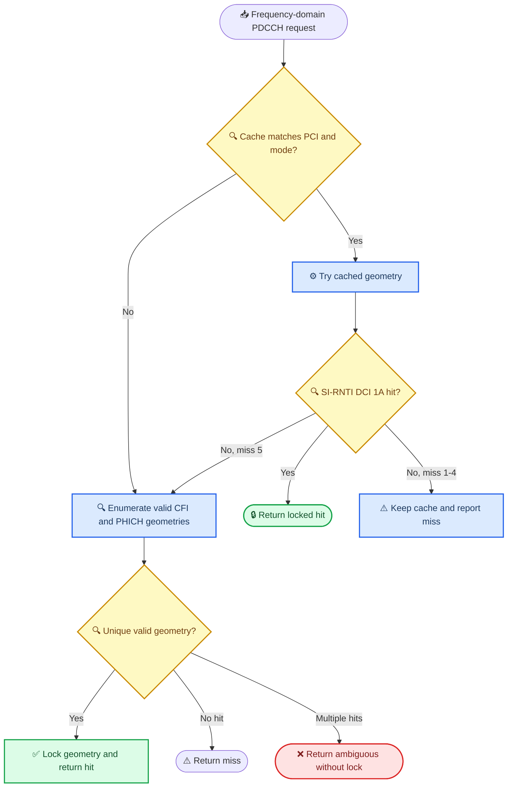

# LTE PDCCH 完整流程说明

本文按当前 `G:\MMSE_CPP` 仓库的真实实现边界，完整说明 LTE `PDCCH` 从控制区确定到 `DCI` 输出的整条链路。

这份文档同时回答两件事：

1. 标准意义上的 `PDCCH` 完整接收流程是什么。
2. 当前 `MMSE_CPP` 已经覆盖了哪些步骤，哪些步骤仍应由仓库外的下游模块完成。

## 1. 先说结论

`PDCCH` 的最终业务输出不是均衡后的 `RE`，而是一个或多个通过 `CRC + RNTI` 校验的 `DCI`。

当前 `MMSE_CPP` 已覆盖的核心能力是：

- 控制区大小约束下的有效 `PDCCH RE` 提取
- `PCFICH / PHICH` 非 `PDCCH` 控制资源排除
- 基于 `CRS` 的信道估计
- `MMSE` 均衡
- `2 Tx port` 发射分集去映射
- 可选的 `QPSK soft bit + PDCCH descrambling` helper
- `REG / CCE` 恢复 helper
- `common search` 候选构造与速率恢复 helper
- UE-specific 候选构造与 `L=1/2/4/8` 速率恢复
- `CRC-RNTI` 校验与 `DCI 1A` 解析 helper
- 默认内建尾咬卷积码译码的正式 CPU common-search 与 UE-specific `DCI 1A` 链路，可由外部回调覆盖
- 1Tx 与 2Tx TD 的 GPU common-search / `DCI 1A` 一站式链路
- 当前 `20 MHz / FDD` 边界内的 SI-RNTI 未知控制区几何搜索、冲突拒绝和调用方持有的缓存锁定

当前 `MMSE_CPP` 仍未覆盖：

- `PCFICH -> CFI` 最终译码判决
- `PHICH` 译码
- 非 `DCI 1A` 的通用最终 `DCI` 解析与输出
- GPU UE-specific、SI-RNTI geometry search、其它 DCI format 或外部 decoder callback

因此，当前仓库在 `PDCCH` 链路中的定位是：

当前仓库在 `PDCCH` 链路中的定位可以概括为：`控制区裁剪 -> RE 提取 -> CRS 信道估计 -> MMSE -> LLR -> 搜索空间候选 -> Viterbi -> CRC-RNTI -> DCI 1A`。

它已能在文档化的 `DCI 1A` 范围内输出命中候选，但仍不是覆盖全部控制信道格式的完整 LTE 接收机。

## 2. 当前项目适用边界

本文以下说明，优先采用当前仓库已经文档化和代码验证的边界：

- LTE 下行 `PDCCH`
- `20 MHz`
- normal CP
- `n_rx_ant in {1, 2}`
- `run_pdcch(...)` 对应 `1 Tx port` 的传统 per-RE 输出面
- `run_pdcch_td(...)` 对应 `2 Tx port` 的 transmit-diversity 专用输出面

与 `PHICH` 保留相关的 helper 还支持更宽一些的配置推导语义，但它不改变当前 equalizer 运行时主契约。

## 3. 完整流程总图

可以把整条链分成三段：

1. 上游先验准备  
   给出控制区大小，以及哪些控制区资源不是 `PDCCH`。
2. `MMSE_CPP` 覆盖段  
   提取有效 `RE`，完成 `CRS` 信道估计、`MMSE` 均衡，必要时做 `2Tx` 去映射。
3. 译码段
   仓库 CPU helper 已覆盖 `QPSK` 软比特、`REG/CCE` 重组、common-search、已知 RNTI 的
   UE-specific search、卷积译码、`CRC/RNTI` 校验与 `DCI 1A` 输出；GPU 一站式入口覆盖
   1Tx/2Tx TD common-search。其它 DCI 格式和未知 UE RNTI 的全空间策略仍由下游负责。

## 4. 13 步完整流程与当前项目映射

### 4.1 获得控制区大小

标准流程里，控制区大小通常来自 `PCFICH` 译出的 `CFI`；工程接入里也可以来自可信外部输入。

在当前仓库中，这一步的落点是：

- `mmse::pdcch::FrontendPdcchIndication::control_symbol_count`
- `mmse::PdcchMmseInput::control_symbol_count`

当前 `PDCCH` 模块不会自己从 `PCFICH` 最终判决 `CFI`。它要求调用方在进入
`run_pdcch(...)` 或 `run_pdcch_td(...)` 之前，已经把 `control_symbol_count`
准备好。当前有效范围是 normal CP 下的 `1..3`。

例外是 `run_pdcch_cpu_si_rnti_geometry_search(...)`：它在当前 `20 MHz / FDD` 边界内
枚举 `CFI=1/2/3` 与有效 PHICH 保留几何，以唯一 `SI-RNTI + DCI 1A` 命中取得控制区几何。
它不等同于 `PCFICH -> CFI` 硬判决，也不替代 PBCH/MIB 取得系统配置。

补充说明：

- 仓库有独立的 `PCFICH` equalized-RE 接口面，但它同样只覆盖 `RE` 提取、`CRS` 信道估计和 `MMSE`，不直接输出最终 `CFI`。

### 4.1a SI-RNTI 未知控制区几何搜索

`run_pdcch_cpu_si_rnti_geometry_search(...)` 是对“可信 CFI/PHICH 配置尚未提供”这一接入场景的
CPU 侧回退路径。它不执行 PCFICH 硬判决，而是由 SI-RNTI 的 CRC-RNTI 与 DCI 1A 语义验证几何。

### 4.2 确定控制区中被 `PCFICH / PHICH` 占用的非 `PDCCH` 资源

这一步的目标是把“控制区里虽然在前几个 OFDM symbol 内，但并不属于 `PDCCH` 的 RE”先扣掉。

对 LTE 而言，典型要排除：

- `PCFICH` 占用的 `REG/RE`
- `PHICH` 占用的 `REG/RE`

在当前仓库中，这一步由 DTO/helper 层完成，主要入口是：

- `mmse::pdcch::append_pcfich_reserved_control_re_list(...)`
- `mmse::pdcch::append_phich_reserved_control_re_list(...)`
- `mmse::pdcch::append_fdd_phich_reserved_control_re_list(...)`

这些 helper 会把结果写入：

- `mmse::pdcch::FrontendPdcchIndication::reserved_control_res`

随后 `make_pdcch_mmse_input(...)` 会把它转换成低层使用的：

- `control_re_exclusion_masks`

这里有一个很重要的工程边界：

- `PCFICH / PHICH` 需要由上游显式标记或通过 helper 生成
- `CRS` 不需要上游传入排除列表，仓库内部会自动跳过 `CRS RE`

### 4.3 提取有效 `PDCCH RE`

标准含义是：在控制区范围内，只保留真正可用于 `PDCCH` 的 `RE`。

当前仓库内部的选择规则是：

- 只看 `symbol = 0 .. control_symbol_count - 1`
- 只看 `prb_bitmap` 里被激活的 `PRB`
- 自动排除 `CRS RE`
- 自动排除 `control_re_exclusion_masks` 标记的非 `PDCCH RE`

对应的核心实现函数是：

- `src/mmse_equalizer_cpu.cpp` 中的 `build_pdcch_re_layout(...)`

它会生成本次 `PDCCH` 的有效资源网格索引集合，后续均衡和下游重组都基于这组索引继续工作。

### 4.4 基于 `CRS` 的信道估计

这一步的标准目标，是利用 LTE 下行 `CRS` 先得到参考位置上的信道样本，再把信道信息提供给 `PDCCH` 有效 `RE`。

在当前仓库中，`PDCCH` 并没有单独发明一套新的估计器，而是复用 equalizer 核心中已经存在的 LTE `CRS` 估计路径。也就是说：

- `PDCCH` 只是换了一种 `RE layout`
- 信道估计主干仍然是统一的 LTE `CRS -> channel estimate -> equalize` 流程

从集成角度看，调用方只需要：

1. 构造 `PdcchMmseInput`
2. 调用 `run_pdcch(...)` 或 `run_pdcch_td(...)`

无需单独管理 `PDCCH` 专属的信道估计模块。

### 4.5 `MMSE` 均衡

得到有效 `PDCCH RE` 和对应的信道后，下一步就是把接收符号均衡成更适合后续译码的软符号。

当前仓库的主入口是：

- `mmse::MmseEqualizerCpuContext::run_pdcch(...)`
- `mmse::MmseEqualizerGpuContext::run_pdcch(...)`

这两个接口会产出：

- `x_hat_re`
- `x_hat_im`
- `sinr`
- `re_grid_indices`

也就是说，`MMSE_CPP` 给下游的并不是最终 `DCI`，而是“每个有效 `PDCCH RE` 的均衡结果 + 每个 `RE` 回到 LTE 网格中的来源位置”。

### 4.6 若是 `2Tx`，做发射分集去映射

这一步只在 `2 Tx port` 的 LTE `PDCCH transmit diversity` 场景成立。

当前仓库对这一步的处理是明确分开的：

- 传统 `run_pdcch(...)` 会拒绝 `n_tx_ports == 2`
- `2Tx` 必须改走 `run_pdcch_td(...)`

对应 CPU 侧关键路径包括：

- `build_pdcch_td_re_pairs(...)`
- `demap_pdcch_transmit_diversity_scalar(...)`

输出也不再是单个 `RE -> 单个软符号` 的传统关系，而是：

- 一个软符号
- 对应一对来源 `RE`
- 通过 `re_grid_indices0 / re_grid_indices1` 透传

这正是当前项目里 `2Tx PDCCH` 与传统 `1Tx PDCCH` 的根本区别。

### 4.7 `QPSK` 软比特生成

标准接收机在拿到均衡后的复数软符号后，要做调制解映射，把 `QPSK` 软信息转换成 `LLR`。

当前仓库已经给出可选 helper：

- `mmse::pdcch::make_backend_pdcch_descrambled_llr_indication(...)`
- `mmse::pdcch::make_backend_pdcch_td_descrambled_llr_indication(...)`

这两个 helper 内部会做两件事：

1. 调用 `mmse::lte::build_max_log_llrs(...)` 生成 `QPSK` 软比特
2. 调用 `mmse::lte::descramble_llrs_inplace(...)` 做 `PDCCH` 解扰

所以从“项目能力边界”看：

- `QPSK soft bit` 生成：已覆盖
- `descrambling`：已覆盖为 helper
- 但这仍不等于完整 `PDCCH` 信道译码

### 4.8 `REG` 重组

LTE `PDCCH` 下游不会直接按“裸 `RE` 顺序”做译码，而是需要先恢复为 `REG` 级组织。

这一层的职责是：

- 把有效 `RE` 按 LTE 控制区规则重新归并成 `REG`
- 保持与真实网格位置一致

当前仓库提供 `REG / CCE` helper：

- `build_pdcch_control_region(...)`

它能把已经按 LTE 控制区交织顺序输出的 RE 恢复成 `PdcchControlRegion`。
`run_pdcch_cpu_*` 入口会在内部使用该 helper；调用方直接消费 equalized RE 时仍可使用
`re_grid_indices` 复核来源位置。

### 4.9 `CCE` 重组

在 LTE 里，一个 `CCE` 由 `9 REG` 构成。完成 `REG` 级恢复后，下一层就是把它们拼成 `CCE`，为后续搜索空间盲检索做准备。

当前仓库把 `REG / CCE` helper 产物固定成：

- `PdcchControlRegion::regs`
- `PdcchControlRegion::cces`

这里要注意一个事实：

- `PdcchChainMetadata` 是调用方定义并透传的请求元数据
- 候选 helper 会在副本中自动回填 `candidate_id / first_cce / aggregation_level`

### 4.10 在搜索空间内做盲检索

完成 `CCE` 重组后，真正的 `PDCCH` 译码才进入盲检索阶段。

这一步通常要做：

- 构建 common search space 与 UE-specific search space
- 按聚合级别 `1 / 2 / 4 / 8 CCE` 枚举候选
- 对每个候选取出对应编码比特流

当前仓库已支持两类 `DCI 1A` 搜索空间：

- common search：`L=4` 最多 4 个候选，`L=8` 最多 2 个候选
- UE-specific：调用方提供目标 RNTI 列表，按 LTE `Y_k` 递推在每子帧枚举 `L=1/2/4/8`，候选上限为 `6/6/2/2`

候选数始终按实际 `N_CCE` 截断；同一 `first_cce` 在不同聚合级别下仍是不同候选。
当前不支持 UE-specific 的非 `DCI 1A` 格式，也不支持未知 RNTI 的全空间枚举。

对应 helper 是：

- `build_pdcch_common_search_candidates(...)`
- `build_pdcch_common_search_candidate_llrs(...)`
- `build_pdcch_ue_specific_search_candidates(...)`
- `decode_pdcch_ue_specific_search_dci_format1a(...)`

### 4.11 对每个候选做解扰、速率恢复、卷积译码

标准 LTE `PDCCH` 下游在拿到每个候选的软比特后，还要继续完成：

1. `PDCCH` 解扰
2. 速率恢复
3. 卷积译码

当前仓库对这一步的覆盖已经延伸到完整的 common-search 和 UE-specific `DCI 1A` CPU helper 链路：

- `descrambling`：已由 `make_backend_pdcch_descrambled_llr_indication(...)` 系列 helper 提供
- `rate recovery`：已由 `recover_pdcch_convolutional_rate_matched_llrs(...)` 提供
- `convolution decode`：默认由仓库内建的 `64-state` 尾咬 Viterbi 完成；外部回调可以覆盖

因此，如果你把 `MMSE_CPP` 接到一个完整接收机里，常见做法是：

1. 先从仓库拿到 `equalized RE`
2. 或者直接拿到 `descrambled LLR`
3. 由仓库 helper 做 common-search 或 UE-specific 候选构造与 rate recovery
4. 由内建 Viterbi 完成尾咬卷积译码，或按集成需要使用外部 decoder 覆盖

### 4.12 做 `CRC + RNTI masking`

卷积译码之后，要做的是 LTE `PDCCH` 最关键的身份判定步骤：

- 检查候选 `DCI` 的 CRC
- 结合目标 `RNTI` 或公共 `RNTI` 做 mask / unmask 判断

只有这一步通过，候选才算真正命中。

当前仓库已经在文档化边界内实现这一步，因此：

- 当前仓库已经可以输出 `CRC-RNTI` 校验结果，并恢复 `RNTI`
- 这条能力当前固定在 `DCI 1A` helper / CPU 链路上

### 4.13 输出通过校验的 `DCI`

通过 `CRC + RNTI` 校验后，系统最终才得到真正可用的 `DCI`。

典型输出包括：

- `RNTI`
- `DCI format`
- `first_cce`
- `aggregation_level`
- 调度授权字段
- `HARQ / MCS / RV / NDI` 等信息

当前仓库不直接定义最终 `DCI` 结构体，但仓库里已经有一份专门的语义说明文档：

当前仓库里已经落地的“最终 `DCI`”边界是：

- `PdcchDciFormat1A`
- `PdcchDciFormat1ADecodeResult`
- `PdcchCommonSearchDecodeResult::hits`
- `PdcchSiRntiSearchResult::hits`
- `PdcchUeSpecificSearchResult::hits`

也就是说，仓库现在可以在文档化边界内输出：

- `common search`
- UE-specific search
- 默认内建尾咬卷积码译码（可选外部回调覆盖）
- `CRC-RNTI` 通过后的 `DCI 1A`

但它仍不等于一个覆盖所有搜索空间、所有 `DCI` 格式和所有实现形态的通用 PDCCH 接收机。

- [LTE DCI 输出语义与 CE/MMSE 接口说明](G:\MMSE_CPP\docs\lte_dci_and_ce_mmse_reference.md)

如果下游要把 `PDCCH` 译码结果正式翻译成业务侧 `DCI` 对象，应以那份文档为解释口径。

## 5. 当前项目推荐接入顺序

结合当前接口面，比较自然的接入顺序是：

1. 上游先得到 `control_symbol_count`
2. 填充 `mmse::pdcch::FrontendPdcchIndication`
3. 通过 helper 追加 `PCFICH / PHICH` 占用的 `reserved_control_res`
4. 调用 `mmse::pdcch::make_pdcch_mmse_input(...)`
5. `1Tx` 走 `run_pdcch(...)`，`2Tx TD` 走 `run_pdcch_td(...)`
6. 若下游希望直接拿 `LLR`，调用 `make_backend_pdcch_descrambled_llr_indication(...)`
7. 若你只需要 `CPU + common search + DCI 1A` 验收，可调用 `run_pdcch_cpu_common_search_decode(...)`
8. 若目标固定为 `SI-RNTI`，可直接调用 `run_pdcch_cpu_si_rnti_search(...)`
9. 若调用方持有 UE RNTI 列表，可调用 `run_pdcch_cpu_ue_specific_search(...)`
10. 若当前 20 MHz/FDD 输入缺少 CFI/PHICH 几何，可调用 `run_pdcch_cpu_si_rnti_geometry_search(...)` 并持有其 cache
11. 若需要 GPU common-search，可调用 `run_pdcch_gpu_common_search_decode(...)` 或 batch 入口；2Tx TD 自动保持连续 CCE 顺序，D2H 仅返回 compact hits
12. 若需要非 `DCI 1A` 的格式或更广泛的 PHY 输入范围，再由下游补齐通用解析与搜索策略

这条集成路径的优点是职责清晰：

- `MMSE_CPP` 专注在它已经做好的 LTE 物理层前半段
- 下游译码器专注在控制信道候选管理和信道译码

## 6. 与当前代码接口的直接对应

| 流程步骤                    | 当前项目主要入口                                        |
| --------------------------- | ------------------------------------------------------- |
| 控制区大小输入              | `FrontendPdcchIndication::control_symbol_count`         |
| `PCFICH` 保留生成           | `append_pcfich_reserved_control_re_list(...)`           |
| `PHICH` 保留生成            | `append_phich_reserved_control_re_list(...)`            |
| DTO 转低层输入              | `make_pdcch_mmse_input(...)`                            |
| 有效 `PDCCH RE` 提取        | `build_pdcch_re_layout(...)`                            |
| `1Tx PDCCH` 均衡            | `run_pdcch(...)`                                        |
| `2Tx PDCCH TD` 去映射与均衡 | `run_pdcch_td(...)`                                     |
| `QPSK` 软比特 + 解扰 helper | `make_backend_pdcch_descrambled_llr_indication(...)`    |
| `2Tx` 软比特 + 解扰 helper  | `make_backend_pdcch_td_descrambled_llr_indication(...)` |
| `REG / CCE` 恢复 helper     | `build_pdcch_control_region(...)`                       |
| `common search` 候选 helper | `build_pdcch_common_search_candidate_llrs(...)`         |
| UE-specific 候选 helper     | `build_pdcch_ue_specific_search_candidates(...)`        |
| 速率恢复 helper             | `recover_pdcch_convolutional_rate_matched_llrs(...)`    |
| `CRC-RNTI / DCI 1A` helper  | `decode_pdcch_dci_format1a_with_adapter(...)`           |
| UE-specific CPU 盲检索      | `run_pdcch_cpu_ue_specific_search(...)`                 |
| SI-RNTI 未知几何 CPU 搜索   | `run_pdcch_cpu_si_rnti_geometry_search(...)`            |
| 1Tx/2Tx common-search GPU   | `run_pdcch_gpu_common_search_decode(...)`               |
| 正式 CPU 盲检索链路         | 见下文                                                  |
| `RE` 网格位置恢复           | `decode_re_grid_index(...)`                             |

## 7. 最后再强调一次边界

如果你的目标是“从 LTE 资源网格一路得到最终 `DCI`”，那么当前项目只完成了这条链的前半段，而且前半段做得比较明确：

- 它知道如何构造有效 `PDCCH` 控制区资源
- 它知道如何基于 `CRS` 做估计与 `MMSE`
- 它知道如何处理 `1Tx` 和 `2Tx TD` 两种 `PDCCH` 软符号输出
- 它还能帮你把软符号进一步变成 `descrambled LLR`
- 它还能在当前文档化边界内，把 common search、UE-specific 和 `SI-RNTI` 几何搜索的 `DCI 1A` CPU 链路串起来

但非 `DCI 1A` 格式、未知 UE RNTI 的完整盲检策略、PCFICH CFI 硬判决和更宽 LTE 配置仍需要仓库外模块补齐。

## 8. 相关文档

- [LTE 下行信道译码总览](G:\MMSE_CPP\docs\lte_pdcch_pdsch_channel_decode_overview.md)
- [PDCCH Chain SDK 文档首页](G:\MMSE_CPP\docs\pdcch_chain_sdk_interface.md)
- [PDCCH Chain SDK 快速开始](G:\MMSE_CPP\docs\pdcch_chain_sdk_quick_start.md)
- [PDCCH Chain SDK API 参考](G:\MMSE_CPP\docs\pdcch_chain_sdk_api_reference.md)
- [PDCCH Module API 集成示例](G:\MMSE_CPP\docs\pdcch_module_api_example.md)
- [LTE DCI 输出语义与 CE/MMSE 接口说明](G:\MMSE_CPP\docs\lte_dci_and_ce_mmse_reference.md)
