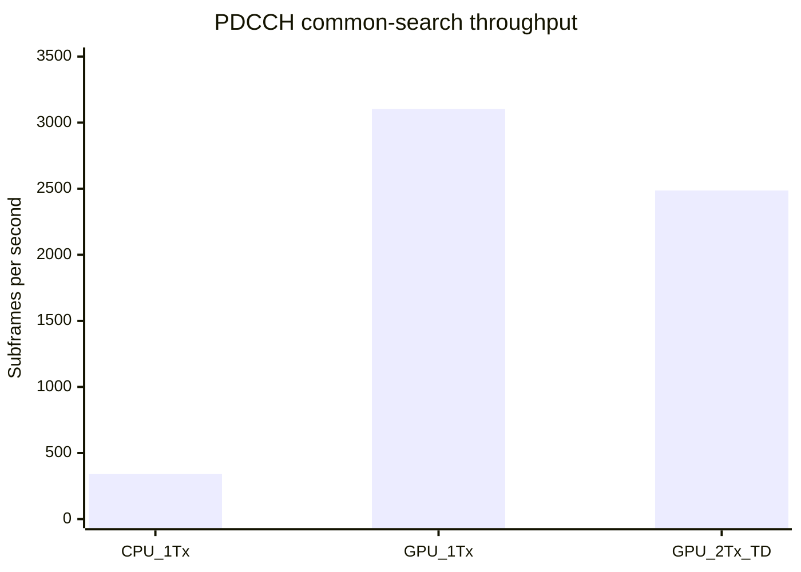

# PDCCH CPU/GPU 性能对比分析（2026-07-14）

_基于当前仓库文档、Release benchmark 与 Nsight Compute 报告，对 LTE PDCCH common-search / DCI 1A 完整译码链进行对比。_

---

## 结论摘要

在当前 `20 MHz / FDD / normal CP / 2Rx / CFI=3` 测试条件下，CPU 单线程完整 common-search 的三次运行中位延迟为 `2935.41 us/subframe`，等效吞吐为 `340.67 subframes/s`。GPU 使用 `2 streams / batch 2` 时，1Tx 三次运行中位吞吐为 `3102.31 subframes/s`，等效 `322.34 us/subframe`，相对 CPU 1Tx 获得 `9.11x` 端到端吞吐提升。

GPU 2Tx TD 在相同调度配置下达到 `2486.65 subframes/s`，等效 `402.15 us/subframe`。该值证明 2Tx TD 完整链仍具备明显的并行收益，但当前 CPU 分阶段 benchmark 固定为 1Tx，因此 `7.30x` 只能作为相对 CPU 1Tx 基线的工程参考，不能视为严格同构的 2Tx 加速比。

性能结构也发生了根本变化：CPU 的 native tail-biting Viterbi 占端到端延迟约 `91.89%`；GPU 上 Viterbi 已降至约 `67-70 us/subframe`，完整链的主要约束转为 host submit、H2D、CE/MMSE、LLR 和多个短 kernel 的固定调度成本。GPU 已把算法计算瓶颈转化为数据搬运与提交效率问题。

## 测试范围与方法

### 功能范围

本报告比较的是当前仓库已经实现的一站式 PDCCH common-search / `DCI 1A` 链路：

```text
控制区 RE 提取 -> CRS 信道估计 -> MMSE 均衡 -> QPSK LLR/解扰
-> REG/CCE common-search 候选 -> rate recovery
-> native tail-biting Viterbi -> CRC-RNTI -> DCI 1A
```

相关功能边界见 [LTE PDCCH 完整流程说明](lte_pdcch_complete_flow.md) 和 [PDCCH Chain SDK API 参考](pdcch_chain_sdk_api_reference.md)。GPU 入口只覆盖 `20 MHz / FDD / normal CP / regular control subframe` 下的 1Tx 与 2Tx TD common-search，不覆盖 UE-specific search、SI-RNTI geometry search、其它 DCI format、CIF 或外部 decoder callback。

### 公共测试条件

| 参数                 |              CPU benchmark |                  GPU benchmark |
| -------------------- | -------------------------: | -----------------------------: |
| 构建                 |                    Release |                        Release |
| LTE 带宽             |                  `100 PRB` |                      `100 PRB` |
| 子载波 / OFDM symbol |                `1200 / 14` |                    `1200 / 14` |
| 接收天线             |                      `2Rx` |                          `2Rx` |
| 控制区               |                    `CFI=3` |                        `CFI=3` |
| PDCCH 候选数         |               `6/subframe` |                   `6/subframe` |
| 译码器               | native tail-biting Viterbi | native GPU tail-biting Viterbi |
| 输入                 |         固定 seed 随机网格 |             固定 seed 随机网格 |
| CRC 结果             |           `0 hit / 6 miss` |               `0 hit / 6 miss` |

两套 benchmark 都覆盖完整 common-search，但统计方式不同：

- CPU 的 [pdcch_decode_bench.cpp](../bench/pdcch_decode_bench.cpp) 使用单个 worker，预热 `10` 个子帧后测量 `100` 个子帧；每个阶段是 host 端顺序计时
- GPU 的 [pdcch_gpu_decode_bench.cpp](../bench/pdcch_gpu_decode_bench.cpp) 每个配置预热 `4` 轮，再测量 `20` 轮 batch；端到端吞吐按 batch 墙钟时间计算，阶段值由 CUDA event 累计
- 本报告对两者各连续执行三次，端到端和阶段结果按三次运行取中位数
- GPU 主对比配置固定为 `2 streams / batch 2`，因为它能表达真实并发收益，同时避免将 batch 深度造成的排队时间误判为单请求延迟

> **口径限制：** GPU 的 `avg_us` 是整个 batch 的墙钟时间。表中的 GPU “等效单子帧时间”使用 `1e6 / throughput` 推导，用于吞吐比较，不等同于单请求独占 GPU 时的服务延迟。

## 端到端性能对比

### 三次运行中位结果

| 路径       | 调度方式              |                  端到端时间 |                  吞吐 |   相对 CPU 1Tx |
| ---------- | --------------------- | --------------------------: | --------------------: | -------------: |
| CPU 1Tx    | 单 worker，单请求     |       `2935.41 us/subframe` |  `340.67 subframes/s` |        `1.00x` |
| GPU 1Tx    | `2 streams / batch 2` | `322.34 us/subframe` 等效值 | `3102.31 subframes/s` |        `9.11x` |
| GPU 2Tx TD | `2 streams / batch 2` | `402.15 us/subframe` 等效值 | `2486.65 subframes/s` | `7.30x` 参考值 |

_吞吐柱状图比较 CPU 1Tx、GPU 1Tx 和 GPU 2Tx TD。GPU 数据采用 `2 streams / batch 2` 三次运行中位数；2Tx 柱只与 CPU 1Tx 基线作工程参考。_



### 稳定性观察

CPU 三次运行的端到端均值分别为：

| 运行 | CPU 1Tx 平均延迟 |
| ---: | ---------------: |
|    1 |     `2935.41 us` |
|    2 |     `2926.31 us` |
|    3 |     `2957.36 us` |

CPU 最大值与最小值相差约 `1.06%`，单线程结果稳定。

GPU 三次运行的目标配置结果如下：

|   运行 |          GPU 1Tx 吞吐 |       GPU 2Tx TD 吞吐 |
| -----: | --------------------: | --------------------: |
|      1 | `3162.01 subframes/s` | `2285.26 subframes/s` |
|      2 | `2361.67 subframes/s` | `2486.65 subframes/s` |
|      3 | `3102.31 subframes/s` | `2884.19 subframes/s` |
| 中位数 | `3102.31 subframes/s` | `2486.65 subframes/s` |

GPU 运行间波动明显高于 CPU，说明短 kernel、Windows GPU 调度、电源状态和 host submit 抖动仍会影响结果。工程验收应继续使用多次完整 sweep 的按配置中位数，而不应使用单次最优值。

### 与历史 wrapper 基线的关系

[2026-07-01 LTE MMSE 预算报告](lte_mmse_budget_report_2026-07-01.md)记录的是 CE/MMSE wrapper，而不是完整 PDCCH 信道译码：

| 历史测试                     |          CPU |                GPU | 结论                          |
| ---------------------------- | -----------: | -----------------: | ----------------------------- |
| 单次 PDCCH CE/MMSE wrapper   |  `292.56 us` |        `358.46 us` | 小工作量独立调用下 CPU 更低   |
| 当前完整 PDCCH common-search | `2935.41 us` | `322.34 us` 等效值 | Viterbi 并行化后 GPU 明显更快 |

这两组结果并不矛盾。历史 wrapper 测试中，GPU 要承担 H2D、launch、event、D2H 和同步固定成本，但没有足够大的下游译码计算去摊薄这些成本。当前完整 common-search 加入 6 个候选的 tail-biting Viterbi 后，CPU 计算量增加约一个数量级，而 GPU 可以并行处理候选、初始 state 和 trellis state，因此端到端结果反转为 GPU 领先。

## 阶段热点分析

### CPU 分阶段结果

| 阶段                | 三次运行中位时间 | 占端到端比例 |
| ------------------- | ---------------: | -----------: |
| CE/MMSE             |     `165.238 us` |      `5.63%` |
| REG/CCE             |      `12.445 us` |      `0.42%` |
| LLR/解扰            |      `22.139 us` |      `0.75%` |
| Candidate gather    |       `4.275 us` |      `0.15%` |
| Rate recovery       |      `18.276 us` |      `0.62%` |
| Tail-biting Viterbi |     `2697.33 us` |     `91.89%` |
| CRC/DCI             |       `0.484 us` |      `0.02%` |
| 完整链              |     `2935.41 us` |       `100%` |

CPU 优化优先级非常清晰：tail-biting Viterbi 是唯一决定性热点。即使把 CE/MMSE、REG/CCE、LLR、candidate gather、rate recovery 和 CRC/DCI 全部压缩为零，理论上也只能从 `2935.41 us` 降到约 `2697.33 us`，收益不足 `9%`。因此 CPU 若继续追求数量级提升，应优先考虑跨候选并行、SIMD branch metric、批量 trellis 或更高层线程并行，而不是继续微调 CRC 或 candidate gather。

### GPU 分阶段结果

GPU 阶段值是每子帧 CUDA event 均值的三次运行中位数：

| 阶段                 |     GPU 1Tx |  GPU 2Tx TD |
| -------------------- | ----------: | ----------: |
| CE/MMSE              |  `69.15 us` |  `94.86 us` |
| LLR/解扰             |  `63.20 us` |  `67.22 us` |
| Rate recovery        |   `4.44 us` |   `6.25 us` |
| Tail-biting Viterbi  |  `67.17 us` |  `69.77 us` |
| CRC/compact          |   `9.04 us` |   `8.93 us` |
| 上述 kernel 阶段合计 | `212.99 us` | `247.03 us` |

GPU 1Tx 中，Viterbi 约占上述 kernel 阶段合计的 `31.54%`；GPU 2Tx TD 中约占 `28.24%`。Viterbi 仍是主要 kernel 之一，但已经不再像 CPU 那样支配完整链。CE/MMSE 与 LLR 的绝对成本已处于相同量级，剩余差额来自 H2D、短 kernel launch、event、host submit 和 batch 收集。

2Tx TD 比 1Tx 慢的主要原因不是候选译码本体：两者 Viterbi 与 CRC 时间接近。差异主要来自更大的 grid metadata、TD pair 去映射和更高的 H2D 成本。

## GPU 优化与 NCU 证据

当前仓库的 `outputs/` 目录保存了 2026-07-14 的 PDCCH kernel 优化前后 Nsight Compute 报告。NCU 使用 profiler replay，绝对时间高于 benchmark 中 CUDA event 的日常运行值，因此适合比较同一 kernel 优化前后，不应直接与端到端 batch 时间相加。

| Kernel        | 优化前 NCU duration | 优化后 NCU duration |     变化 |
| ------------- | ------------------: | ------------------: | -------: |
| Rate recovery |          `77.95 us` |           `3.23 us` | `24.13x` |
| Viterbi       |         `134.82 us` |         `106.24 us` |  `1.27x` |
| CRC           |          `36.74 us` |           `9.18 us` |  `4.00x` |
| Compact hits  |           `3.58 us` |           `3.62 us` | 基本不变 |

Rate recovery 的主要改进来自固定 `132` 项 input-offset 表、每 candidate 单 block，以及每个输出线程按 `offset, offset + 132, ...` 的确定顺序累加。该实现避免每个输出线程重复扫描完整 `288/576-bit` candidate，同时保持 CPU/GPU 浮点累加顺序与 bit-equivalence。

CRC kernel 先按严格 `>` 选择最佳 closed state，再只执行一次 traceback，保留相同 metric 时最低 state 优先的语义。Viterbi 则通过固定 branch-class 表和 warp shuffle 减少重复 parity/branch metric 计算，同时保留 double metrics。

NCU 还显示 rate recovery achieved occupancy 从 `2.61%` 提升到 `10.18%`。优化后绝对时长只有 `3.23 us`，继续提高 occupancy 的收益有限；下一轮不应再把它作为首要目标。

## 数据传输与 host 开销

当前 GPU compact-result 协议只回传 hit count 和固定容量结果，不回传完整 equalized grid、SINR 或 LLR：

| 路径       | H2D/subframe | D2H/subframe |
| ---------- | -----------: | -----------: |
| GPU 1Tx    |   `288612 B` |      `148 B` |
| GPU 2Tx TD |   `484168 B` |      `148 B` |

D2H 已被压缩到 `148 B/subframe`，不是当前瓶颈。2Tx H2D 比 1Tx 多 `195556 B/subframe`，主要来自 TD 路径所需的完整 grid metadata 与 pair/reverse-map 数据。1Tx 使用 compact metadata prefix，因此 H2D 更低。

一次当前目标配置运行中，1Tx 的 host submit 为 `254.77 us/subframe`，2Tx TD 为 `331.74 us/subframe`。这些值会与 GPU kernel 异步执行重叠，不能和 kernel event 时间直接求和，但它们解释了为什么 GPU 端到端吞吐仍明显低于纯 kernel 阶段倒数所暗示的上限。

从 [MMSE CUDA Profiling 报告（2026-07-03）](mmse_cuda_profile_report_2026-07-03.md)也能得到一致结论：CE/MMSE 数学 kernel 已进入微秒级，完整调用更多受 staging、metadata packing、D2H/sync 和提交框架成本影响。当前 PDCCH 完整译码在消除 rate recovery 与 CRC 热点后，已经进入相同的性能阶段。

## 工程判断与优化建议

### CPU 路径

1. 将 tail-biting Viterbi 作为唯一一级热点，任何 CPU 性能项目都应先量化它的收益上限
2. 优先评估跨 candidate 并行或 batch 并行，因为 common-search 固定有 6 个相互独立候选
3. 在不改变 double metrics、严格 `>` tie-break 和闭合路径语义的前提下，再评估 branch metric SIMD 化
4. 保留 CPU 路径作为低并发、无 CUDA 环境、UE-specific search、geometry search 和外部 decoder callback 的完整功能基线

### GPU 路径

1. 优先降低 host submit 与 grid metadata H2D，尤其是 2Tx TD 的完整 metadata 传输
2. 评估将不可变 control-region/candidate/Gold 元数据按 key 缓存，避免每子帧重复生成和提交
3. 保持 compact D2H；`148 B/subframe` 已足够低，不值得以 ABI 或稳定性换取进一步压缩
4. 暂不优先继续优化 rate recovery、CRC 或 compact hits，它们的绝对时间已低于 `10 us`
5. 仅在 host/H2D 成本下降后，再重新评估 Viterbi 是否仍是最大 kernel 热点
6. CUDA Graph、持续 ring 调度和 full-grid H2D 压缩应作为后续独立课题，不应与当前结果混为已实现能力

### 路径选择

| 场景                          | 推荐路径           | 原因                                  |
| ----------------------------- | ------------------ | ------------------------------------- |
| 高吞吐 common-search / DCI 1A | GPU batch          | 当前 1Tx 吞吐约为 CPU 的 `9.11x`      |
| 单请求、极低并发              | 需要按延迟目标实测 | GPU 吞吐优势不等于单请求排队延迟优势  |
| 2Tx TD common-search          | GPU batch          | 已支持完整 TD 去映射与 compact result |
| UE-specific search            | CPU                | 当前 GPU 不支持                       |
| SI-RNTI geometry search       | CPU                | 当前 GPU 不支持多几何枚举与缓存锁定   |
| 外部 Viterbi callback         | CPU                | GPU 仅支持 native decoder             |
| 无 CUDA 或资源受限部署        | CPU                | 无 H2D、launch、event 和显存依赖      |

## 限制与复现建议

本报告的加速比只适用于当前 benchmark workload，不应外推为所有 PDCCH 场景的固定倍数。主要限制包括：

- CPU 基准固定为 1Tx；没有同一程序下的 CPU 2Tx TD 分阶段基线
- 随机网格产生 `0 hit / 6 miss`，没有覆盖命中后 host DCI 解析的复杂输出分布
- GPU 结果受 Windows 调度、GPU 电源状态和短 kernel launch 抖动影响
- CPU 与 GPU 阶段计时机制不同，阶段值只能用于热点结构比较
- GPU NCU replay 结果不能与普通 benchmark event 时间直接相加
- 当前 GPU 仅覆盖 common-search / `DCI 1A`，不能代表 CPU 更广的 UE-specific 与 geometry-search 能力

建议复现时使用当前 Release 目标：

```powershell
cmake --build build --config Release --target pdcch_decode_bench pdcch_gpu_decode_bench
.\build\Release\pdcch_decode_bench.exe
.\build\Release\pdcch_gpu_decode_bench.exe
```

性能验收应至少连续运行三次完整 GPU sweep，并按 `Tx/stream_count/batch` 分组取吞吐中位数。正确性门禁应继续覆盖 `CFI 1/2/3 x Rx 1/2 x Tx 1/2 x L4/L8`、失败恢复、stale-result、TD pair 顺序、CRC/bit-equivalence 和 D2H/H2D 字节记账。

## 数据来源

- [LTE PDCCH 完整流程说明](lte_pdcch_complete_flow.md)
- [PDCCH Chain SDK 快速开始](pdcch_chain_sdk_quick_start.md)
- [PDCCH Chain SDK API 参考](pdcch_chain_sdk_api_reference.md)
- [LTE DCI 输出语义与 CE/MMSE 接口说明](lte_dci_and_ce_mmse_reference.md)
- [LTE MMSE 预算报告（2026-07-01）](lte_mmse_budget_report_2026-07-01.md)
- [MMSE CUDA Profiling 报告（2026-07-03）](mmse_cuda_profile_report_2026-07-03.md)
- [CPU benchmark 实现](../bench/pdcch_decode_bench.cpp)
- [GPU benchmark 实现](../bench/pdcch_gpu_decode_bench.cpp)
- `outputs/pdcch_*_baseline_2026_07_14.ncu-rep`
- `outputs/pdcch_*_optimized_2026_07_14.ncu-rep`
