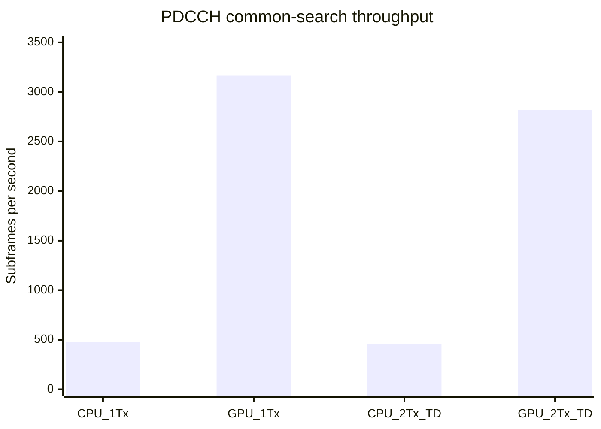

# PDCCH CPU/GPU 性能对比分析（2026-07-14）

_基于当前仓库文档、Release benchmark 与 Nsight Compute 报告，对 LTE PDCCH common-search / DCI 1A 完整译码链进行对比。_

---

## 结论摘要

当前结论使用确定性 `mixed` workload：四个请求循环包含 `0 hit`、L4 单 hit、L8 派生的 L4+L8 双 hit、以及非重叠 L4+L8 的三 hit。每次命中均在 host 端完成 bit 展开、CRC 复核和 DCI 1A 字段解析，覆盖 `start_prb`、`n_prb`、MCS、RV 与 `N_PRB^1A`。因此不再把随机 `0 hit / 6 miss` 当作完整链代表负载。

在 `20 MHz / FDD / normal CP / 2Rx / CFI=3`、Release、相同 `mixed` workload 下，CPU 单线程完整 common-search 的三次中位端到端 host-wall 时间为 `2106.26 us/subframe`，等效吞吐为 `474.78 subframes/s`。GPU 使用 `2 streams / batch 2` 时，1Tx 三次中位吞吐为 `3168.09 subframes/s`，吞吐等效时间为 `315.65 us/subframe`，相对同构 CPU 1Tx 为 `6.67x`。

CPU 2Tx TD 中位端到端 host-wall 时间为 `2177.02 us/subframe`，等效吞吐为 `459.34 subframes/s`。GPU 2Tx TD 在相同调度配置下为 `2819.76 subframes/s`，吞吐等效时间为 `354.64 us/subframe`，相对同构 CPU 2Tx TD 为 `6.14x`。CPU stage 是 host `steady_clock` 区间，GPU stage 是每请求 CUDA event interval；二者仅用于各自后端的热点诊断，不能合并或跨后端相加。

## 测试范围与方法

### 功能范围

本报告比较的是当前仓库已经实现的一站式 PDCCH common-search / `DCI 1A` 链路：

```text
控制区 RE 提取 -> CRS 信道估计 -> MMSE 均衡 -> QPSK LLR/解扰
-> REG/CCE common-search 候选 -> rate recovery
-> native tail-biting Viterbi -> CRC-RNTI -> DCI 1A
```

相关功能边界见 [LTE PDCCH 完整流程说明](lte_pdcch_complete_flow.md) 和 [PDCCH Chain SDK API 参考](pdcch_chain_sdk_api_reference.md)。GPU 入口只覆盖 `20 MHz / FDD / normal CP / regular control subframe` 下的 1Tx 与 2Tx TD common-search，不覆盖 UE-specific search、SI-RNTI geometry search、其它 DCI format、CIF 或外部 decoder callback。

### 公共测试条件

| 参数                 |                  CPU benchmark |                  GPU benchmark |
| -------------------- | -----------------------------: | -----------------------------: |
| 构建                 |                        Release |                        Release |
| LTE 带宽             |                      `100 PRB` |                      `100 PRB` |
| 子载波 / OFDM symbol |                    `1200 / 14` |                    `1200 / 14` |
| 接收天线             |                          `2Rx` |                          `2Rx` |
| 发射模式             |                 `1Tx / 2Tx TD` |                 `1Tx / 2Tx TD` |
| 控制区               |                        `CFI=3` |                        `CFI=3` |
| PDCCH 候选数         |                   `6/subframe` |                   `6/subframe` |
| 译码器               |     native tail-biting Viterbi | native GPU tail-biting Viterbi |
| 输入                 |      确定性 `mixed` 4 请求循环 |      确定性 `mixed` 4 请求循环 |
| 每 4 子帧 hit 分布   | `0 / 1 / 2 / 3`（总 `6` hits） | `0 / 1 / 2 / 3`（总 `6` hits） |
| Host DCI 字段验证    |               L4/L8 全字段验证 |               L4/L8 全字段验证 |

两套 benchmark 都覆盖完整 common-search，但统计方式不同：

- CPU 的 [pdcch_decode_bench.cpp](../bench/pdcch_decode_bench.cpp) 使用单个 worker，分别运行 `--n-tx-ports 1` 与 `--n-tx-ports 2`；预热 `10` 个子帧后测量 `100` 个子帧。`subframe_1ms.e2e_host_wall` 是可与 GPU 对比的单请求 host-wall，stage 都是不可组合的 host `steady_clock` 区间；命中统计使用 `*_count` 而非时间单位
- GPU 的 [pdcch_gpu_decode_bench.cpp](../bench/pdcch_gpu_decode_bench.cpp) 每个配置预热 `4` 轮，再测量 `20` 轮 batch；`batch_wall_*` 是唯一可比较的 host-wall E2E，`throughput_equivalent_us` 仅由 batch 吞吐推导。`device.cuda_event.*` 是每请求 device interval，不可跨 stream 相加
- 本报告对两者各连续执行三次，端到端和阶段结果按三次运行取中位数
- GPU 主对比配置固定为 `2 streams / batch 2`，因为它能表达真实并发收益，同时避免将 batch 深度造成的排队时间误判为单请求延迟

> **计时边界：** CPU/GPU 横向比较只使用同 workload 的 host `steady_clock` E2E。GPU 的 `batch_wall_*` 不是单请求服务延迟，`throughput_equivalent_us = batch_wall / batch` 只用于吞吐比较。CUDA event、host submit/collect 和 NCU replay 都不得相加为端到端时间。

## 端到端性能对比

### 三次运行中位结果

| 路径       | 调度方式              |                  端到端时间 |                  吞吐 | 相对同构 CPU |
| ---------- | --------------------- | --------------------------: | --------------------: | -----------: |
| CPU 1Tx    | 单 worker，单请求     |       `2106.26 us/subframe` |  `474.78 subframes/s` |      `1.00x` |
| GPU 1Tx    | `2 streams / batch 2` | `315.65 us/subframe` 等效值 | `3168.09 subframes/s` |      `6.67x` |
| CPU 2Tx TD | 单 worker，单请求     |       `2177.02 us/subframe` |  `459.34 subframes/s` |      `1.00x` |
| GPU 2Tx TD | `2 streams / batch 2` | `354.64 us/subframe` 等效值 | `2819.76 subframes/s` |      `6.14x` |

_吞吐柱状图比较 CPU/GPU 的 1Tx 与 2Tx TD。GPU 数据采用 `2 streams / batch 2` 三次运行中位数。_



### 稳定性观察

CPU 三次运行的端到端均值分别为：

| 运行 | CPU 1Tx 平均延迟 | CPU 2Tx TD 平均延迟 |
| ---: | ---------------: | ------------------: |
|    1 |     `2106.26 us` |        `2177.02 us` |
|    2 |     `2157.95 us` |        `2192.37 us` |
|    3 |     `2096.78 us` |        `2161.97 us` |

CPU 1Tx 最大值与最小值相差约 `2.92%`；CPU 2Tx TD 对应差值为 `1.40%`。两者都显著小于 GPU sweep 的运行间波动。

GPU 三次运行的目标配置结果如下：

|   运行 |          GPU 1Tx 吞吐 |       GPU 2Tx TD 吞吐 |
| -----: | --------------------: | --------------------: |
|      1 | `3168.09 subframes/s` | `2819.76 subframes/s` |
|      2 | `3384.12 subframes/s` | `2486.28 subframes/s` |
|      3 | `2733.83 subframes/s` | `3001.61 subframes/s` |
| 中位数 | `3168.09 subframes/s` | `2819.76 subframes/s` |

GPU 运行间波动明显高于 CPU，说明短 kernel、Windows GPU 调度、电源状态和 host submit 抖动仍会影响结果。工程验收应继续使用多次完整 sweep 的按配置中位数，而不应使用单次最优值。

### 与历史 wrapper 基线的关系

[2026-07-01 LTE MMSE 预算报告](lte_mmse_budget_report_2026-07-01.md)记录的是 CE/MMSE wrapper，而不是完整 PDCCH 信道译码：

| 历史测试                     |          CPU |                GPU | 结论                          |
| ---------------------------- | -----------: | -----------------: | ----------------------------- |
| 单次 PDCCH CE/MMSE wrapper   |  `292.56 us` |        `358.46 us` | 小工作量独立调用下 CPU 更低   |
| 旧 random miss-only complete | `2935.41 us` | `322.34 us` 等效值 | 仅作历史无命中基线            |
| 当前 mixed complete          | `2106.26 us` | `315.65 us` 等效值 | 真实 host DCI 解析下 GPU 更快 |

这两组结果并不矛盾。历史 wrapper 测试中，GPU 要承担 H2D、launch、event、D2H 和同步固定成本，但没有足够大的下游译码计算去摊薄这些成本。当前完整 common-search 加入 6 个候选的 tail-biting Viterbi 后，CPU 计算量增加约一个数量级，而 GPU 可以并行处理候选、初始 state 和 trellis state，因此端到端结果反转为 GPU 领先。

## 阶段热点分析

### CPU 分阶段结果

| 阶段（host `steady_clock`）  |      CPU 1Tx | CPU 1Tx/E2E |    CPU 2Tx TD | CPU 2Tx TD/E2E |
| ---------------------------- | -----------: | ----------: | ------------: | -------------: |
| Tail-biting Viterbi          | `1868.47 us` |    `88.71%` | `1822.530 us` |       `83.72%` |
| CRC/DCI（包含真实 hit 解析） | 已纳入完整链 |           - |  已纳入完整链 |              - |
| 完整链 E2E                   | `2106.26 us` |   `100.00%` | `2177.020 us` |      `100.00%` |

各 stage 是独立 host timing probe，不覆盖 DTO 构造、stage 间 vector 生命周期及所有控制开销，因此不构成可加和分解。完整链 E2E 是该表中唯一用于占比与 CPU/GPU 对比的端到端指标。

CPU 优化优先级仍然清晰：tail-biting Viterbi 在真实命中分布下仍占 1Tx/2Tx TD E2E 的 `88.71%`/`83.72%`。因此应优先评估跨 candidate 并行、SIMD branch metric、批量 trellis 或更高层线程并行，而不是微调 CRC 或 candidate gather。

### GPU 分阶段结果

GPU 阶段值是不可组合的每请求 CUDA event interval；它们不是 CPU host stage，也不能与 host submit/collect 或 batch wall 相加。目标配置三次中位数中可直接观察到：

| 指标                                   |     GPU 1Tx |  GPU 2Tx TD |
| -------------------------------------- | ----------: | ----------: |
| CUDA event Viterbi interval            |  `67.61 us` |  `65.90 us` |
| host collect（含 DCI materialization） |  `49.08 us` |  `80.55 us` |
| batch-wall 吞吐等效时间                | `315.65 us` | `354.64 us` |

Viterbi 仍是主要 device interval 之一，但已经不再像 CPU 那样支配完整链。端到端剩余差额来自 H2D、短 kernel launch、event、host submit 和 batch 收集；这些路径存在异步重叠，不能按表中数值相加。

2Tx TD 比 1Tx 慢的主要原因不是候选译码本体：两者 Viterbi 与 CRC 时间接近。差异主要来自更大的 grid metadata、TD pair 去映射和更高的 H2D 成本。

## GPU 优化与 NCU 证据

当前仓库的 `outputs/` 目录保存了 2026-07-14 的历史 PDCCH kernel 优化前后 Nsight Compute 报告。NCU 使用 profiler replay，绝对时间高于 benchmark 中 CUDA event 的日常运行值，只适合比较同一 kernel 的 replay 前后变化，不能与 native benchmark 相加。为从执行目标和 stdout schema 层面隔离数据，新的 [pdcch_ncu_workload.cpp](../bench/pdcch_ncu_workload.cpp) 只输出 `mmse.ncu.v1`、workload identity、hit count 与 checksum，绝不输出 `avg_us`、`p50_us` 或 `*_gpu_us`。

| Kernel        | 优化前 NCU duration | 优化后 NCU duration |     变化 |
| ------------- | ------------------: | ------------------: | -------: |
| Rate recovery |          `77.95 us` |           `3.23 us` | `24.13x` |
| Viterbi       |         `134.82 us` |         `106.24 us` |  `1.27x` |
| CRC           |          `36.74 us` |           `9.18 us` |  `4.00x` |
| Compact hits  |           `3.58 us` |           `3.62 us` | 基本不变 |

Rate recovery 的主要改进来自固定 `132` 项 input-offset 表、每 candidate 单 block，以及每个输出线程按 `offset, offset + 132, ...` 的确定顺序累加。该实现避免每个输出线程重复扫描完整 `288/576-bit` candidate，同时保持 CPU/GPU 浮点累加顺序与 bit-equivalence。

CRC kernel 先按严格 `>` 选择最佳 closed state，再只执行一次 traceback，保留相同 metric 时最低 state 优先的语义。Viterbi 则通过固定 branch-class 表和 warp shuffle 减少重复 parity/branch metric 计算，同时保留 double metrics。

NCU 还显示 rate recovery achieved occupancy 从 `2.61%` 提升到 `10.18%`。优化后绝对时长只有 `3.23 us`，继续提高 occupancy 的收益有限；下一轮不应再把它作为首要目标。新的 replay 应使用专用目标，例如：

```powershell
ncu --target-processes all --set basic --kernel-name-base demangled -c 1 --profile-from-start on -f -o .\outputs\pdcch_mixed_replay .\build\Release\pdcch_ncu_workload.exe
```

## 数据传输与 host 开销

当前 GPU compact-result 协议只回传 hit count 和固定容量结果，不回传完整 equalized grid、SINR 或 LLR：

| 路径       | H2D/subframe | D2H/subframe |
| ---------- | -----------: | -----------: |
| GPU 1Tx    |   `288612 B` |      `148 B` |
| GPU 2Tx TD |   `484168 B` |      `148 B` |

D2H 已被压缩到 `148 B/subframe`，不是当前瓶颈。2Tx H2D 比 1Tx 多 `195556 B/subframe`，主要来自 TD 路径所需的完整 grid metadata 与 pair/reverse-map 数据。1Tx 使用 compact metadata prefix，因此 H2D 更低。

GPU `host_steady.collect_per_request_mean_us` 现在覆盖 stream synchronize 之后的 compact hit materialization：44-bit 展开、CRC 结果复核和 DCI 字段解析均包含在内。它会与 device 工作的提交阶段产生异步重叠，不能和 CUDA event interval 或 batch wall 直接求和。

从 [MMSE CUDA Profiling 报告（2026-07-03）](mmse_cuda_profile_report_2026-07-03.md)也能得到一致结论：CE/MMSE 数学 kernel 已进入微秒级，完整调用更多受 staging、metadata packing、D2H/sync 和提交框架成本影响。当前 PDCCH 完整译码在消除 rate recovery 与 CRC 热点后，已经进入相同的性能阶段。

## GPU 显存占用测试

显存测试使用 Release `pdcch_gpu_decode_bench --memory-report`，固定为与主性能对比相同的 `2 streams / batch 2 / mixed` 配置。测试先执行一次不计入结果的 CUDA runtime prime，随后对 1Tx 和 2Tx TD 分别创建独立 context，并在初始化前、初始化后、4 轮预热后、20 轮同步 batch 后和 context 析构后调用 `cudaMemGetInfo`。同时按实际 `cudaMalloc` 参数统计每个 stream slot 的固定容量设备缓冲区。

### 固定设备缓冲区分项

| 设备缓冲区                        |    每 slot 字节 |  2 streams 字节 |    2 streams MiB |      总量占比 |
| --------------------------------- | --------------: | --------------: | ---------------: | ------------: |
| 输入 grid：2Rx 复数四平面         |      `268800 B` |      `537600 B` |     `0.5127 MiB` |      `15.77%` |
| Grid metadata / TD reverse map    |      `214536 B` |      `429072 B` |     `0.4092 MiB` |      `12.59%` |
| CRS 信道估计                      |      `537600 B` |     `1075200 B` |     `1.0254 MiB` |      `31.54%` |
| MMSE 输出：xhat real/imag 与 SINR |      `403200 B` |      `806400 B` |     `0.7690 MiB` |      `23.65%` |
| sigma2 / scratch / completion     |          `24 B` |          `48 B` |    `<0.0001 MiB` |      `<0.01%` |
| PDCCH LLR                         |      `134400 B` |      `268800 B` |     `0.2563 MiB` |       `7.88%` |
| PDCCH Gold words                  |        `4200 B` |        `8400 B` |     `0.0080 MiB` |       `0.25%` |
| PDCCH candidate descriptors       |          `72 B` |         `144 B` |     `0.0001 MiB` |      `<0.01%` |
| PDCCH rate-recovery LLR           |        `3168 B` |        `6336 B` |     `0.0060 MiB` |       `0.19%` |
| PDCCH Viterbi survivor/terminal   |      `138240 B` |      `276480 B` |     `0.2637 MiB` |       `8.11%` |
| PDCCH candidate/compact results   |         `292 B` |         `584 B` |     `0.0006 MiB` |       `0.02%` |
| **显式设备缓冲区合计**            | **`1704532 B`** | **`3409064 B`** | **`3.2511 MiB`** | **`100.00%`** |

信道估计、grid 和 MMSE 输出合计占显式设备缓冲区的 `83.55%`；PDCCH LLR、Gold、candidate、rate recovery、Viterbi 与结果缓冲区合计为 `560744 B`（`0.5348 MiB`，`16.45%`）。Viterbi 设备缓冲区只有 `0.2637 MiB/2 streams`，因此当前 Viterbi 的性能热点不是由显存容量压力造成。

### 生命周期实测

| 模式       |     显式 `cudaMalloc` 合计 |             初始化观测增量 | 运行期峰值新增 | 析构后未回收增量 |
| ---------- | -------------------------: | -------------------------: | -------------: | ---------------: |
| GPU 1Tx    | `3409064 B` (`3.2511 MiB`) | `4194304 B` (`4.0000 MiB`) |          `0 B` |            `0 B` |
| GPU 2Tx TD | `3409064 B` (`3.2511 MiB`) | `4194304 B` (`4.0000 MiB`) |          `0 B` |            `0 B` |

`cudaMemGetInfo` 的 `4 MiB` 初始化增量高于 `3.2511 MiB` 显式缓冲区合计，差额来自 CUDA allocator 分配粒度以及 stream/event 等 runtime 状态，不能归入某个算法数组。预热和 20 轮测量期间没有额外 `cudaMalloc`，同步边界观察到的运行期峰值新增为 `0 B`；context 析构后两种模式均回到各自基线。

1Tx 与 2Tx TD 使用相同的最大容量 workspace，因此驻留显存相同。2Tx TD 的 `484168 B/subframe` H2D 高于 1Tx 的 `288612 B/subframe`，原因是每请求复制的 metadata 前缀不同，不代表 2Tx 分配了更大的设备数组。该测试的峰值是同步 batch 边界的 `cudaMemGetInfo` 观测值，不是进程级逐 kernel 高水位；但当前请求路径不执行运行期设备分配，因此足以验证固定 workspace 和释放行为。原始输出保存在 `outputs/pdcch_gpu_memory_2026_07_15.txt`。

## 工程判断与优化建议

### CPU 路径

1. 将 tail-biting Viterbi 作为唯一一级热点，任何 CPU 性能项目都应先量化它的收益上限
2. 优先评估跨 candidate 并行或 batch 并行，因为 common-search 固定有 6 个相互独立候选
3. 在不改变 double metrics、严格 `>` tie-break 和闭合路径语义的前提下，再评估 branch metric SIMD 化
4. 保留 CPU 路径作为低并发、无 CUDA 环境、UE-specific search、geometry search 和外部 decoder callback 的完整功能基线

### GPU 路径

1. 优先降低 host submit 与 grid metadata H2D，尤其是 2Tx TD 的完整 metadata 传输
2. 评估将不可变 control-region/candidate/Gold 元数据按 key 缓存，避免每子帧重复生成和提交
3. 保持 compact D2H；`148 B/subframe` 已足够低，不值得以 ABI 或稳定性换取进一步压缩
4. 暂不优先继续优化 rate recovery、CRC 或 compact hits，它们的绝对时间已低于 `10 us`
5. 仅在 host/H2D 成本下降后，再重新评估 Viterbi 是否仍是最大 kernel 热点
6. CUDA Graph、持续 ring 调度和 full-grid H2D 压缩应作为后续独立课题，不应与当前结果混为已实现能力

### 路径选择

| 场景                          | 推荐路径           | 原因                                      |
| ----------------------------- | ------------------ | ----------------------------------------- |
| 高吞吐 common-search / DCI 1A | GPU batch          | 当前 mixed 1Tx 吞吐约为 CPU 的 `6.67x`    |
| 单请求、极低并发              | 需要按延迟目标实测 | GPU 吞吐优势不等于单请求排队延迟优势      |
| 2Tx TD common-search          | GPU batch          | 当前 mixed 吞吐约为 CPU 2Tx TD 的 `6.14x` |
| UE-specific search            | CPU                | 当前 GPU 不支持                           |
| SI-RNTI geometry search       | CPU                | 当前 GPU 不支持多几何枚举与缓存锁定       |
| 外部 Viterbi callback         | CPU                | GPU 仅支持 native decoder                 |
| 无 CUDA 或资源受限部署        | CPU                | 无 H2D、launch、event 和显存依赖          |

## 限制与复现建议

本报告的加速比只适用于当前 benchmark workload，不应外推为所有 PDCCH 场景的固定倍数。主要限制包括：

- GPU 结果受 Windows 调度、GPU 电源状态和短 kernel launch 抖动影响
- 当前 GPU 仅覆盖 common-search / `DCI 1A`，不能代表 CPU 更广的 UE-specific 与 geometry-search 能力
- `mixed` 合成负载覆盖确定性 DCI grant，不代表真实空口的信道衰落、干扰、RNTI 群和命中概率分布
- CPU/GPU stage 仍使用不同 clock domain，只能用于各自后端热点诊断；比较必须使用 host-wall E2E
- NCU replay 仍独立于 native CUDA event 和 batch wall；专用 `mmse.ncu.v1` target 防止三者在记录层面混用
- 2Tx TD geometry-search 现已运行 cold/locked/reprobe。完整 CCE 布局的 source RE 始终为 `36` 的倍数；窄带 CFI/PHICH profile 可能没有完整 CCE，按合法空 backend 作为普通 miss，不补齐虚拟 RE，也不要求物理子载波连续

建议复现时使用当前 Release 目标：

```powershell
cmake --build build --config Release --target pdcch_decode_bench pdcch_gpu_decode_bench pdcch_ncu_workload
.\build\Release\pdcch_decode_bench.exe --workload mixed --n-tx-ports 1
.\build\Release\pdcch_decode_bench.exe --workload mixed --n-tx-ports 2
.\build\Release\pdcch_decode_bench.exe --workload mixed --n-prb 6 --n-tx-ports 2
.\build\Release\pdcch_gpu_decode_bench.exe --workload mixed
.\build\Release\pdcch_gpu_decode_bench.exe --memory-report
.\build\Release\pdcch_ncu_workload.exe
```

性能验收应至少连续运行三次 CPU 1Tx、CPU 2Tx TD 与完整 GPU sweep，并按 `workload/Tx/stream_count/batch` 分组取吞吐中位数。`random` 仅用于历史 miss-only 趋势，不能与 `mixed` 计算加速比。正确性门禁继续覆盖 `CFI 1/2/3 x Rx 1/2 x Tx 1/2 x L4/L8`、失败恢复、stale-result、TD source-order、CRC/bit-equivalence、DCI 字段、0/1/multi hit 分布和 D2H/H2D 字节记账。

## 数据来源

- [LTE PDCCH 完整流程说明](lte_pdcch_complete_flow.md)
- [PDCCH Chain SDK 快速开始](pdcch_chain_sdk_quick_start.md)
- [PDCCH Chain SDK API 参考](pdcch_chain_sdk_api_reference.md)
- [LTE DCI 输出语义与 CE/MMSE 接口说明](lte_dci_and_ce_mmse_reference.md)
- [LTE MMSE 预算报告（2026-07-01）](lte_mmse_budget_report_2026-07-01.md)
- [MMSE CUDA Profiling 报告（2026-07-03）](mmse_cuda_profile_report_2026-07-03.md)
- [CPU benchmark 实现](../bench/pdcch_decode_bench.cpp)
- [GPU benchmark 实现](../bench/pdcch_gpu_decode_bench.cpp)
- [NCU replay workload](../bench/pdcch_ncu_workload.cpp)
- `outputs/pdcch_gpu_memory_2026_07_15.txt`
- `outputs/pdcch_*_baseline_2026_07_14.ncu-rep`
- `outputs/pdcch_*_optimized_2026_07_14.ncu-rep`
